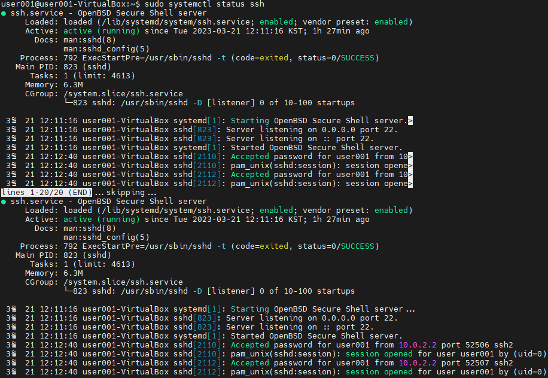

# 터미널 에뮬레이터

터미널을 편리하게 쓸 수 있는 툴  
리눅스 개발자들이 흔히 사용

# 원격 접속

## 원격지 컴퓨터 접속 환경

### 1. GUI 기반 원격 접속

VNC Viewer  

> 임베디드 리눅스에서 GUI 원격 접속이 안되는 경우가 많다

### 2. CLI 기반 원격 접속

SSH, Telnet

## 서버란?

- 요청을 받아서, 원하는 처리를 해준다
- 요청 받아 처리 후, 결과를 요청한 곳에 전달한다
- 서버 프로그램
  - 클라이언트의 입력을 원격지 PC에 입력해주는 프로그램
  - 결과 화면을 클라이언트에 전달한다
  - ex) openSSH

## 클라이언트란 ?

- 클라이언트는 서버에게 요청을 하는 것을 뜻한다
- 클라이언트 프로그램
  - 키보드 입력을 서버에 전달한다
  - ex) mobaXterm


## 서버 프로그램 설치

``` Bash
$ sudo apt install openssh-server
```

- 설치시 서버 프로그램이 자동적으로 실행된다
- 윈도우의 `서비스` 처럼 백그라운드에서 실행되고 있다

> 리눅스에서는 백그라운드에서 실행되는 프로그램을 `시스템 데몬`이라고 한다

### 시스템 데몬 상태 확인 방법

``` Bash
$ sudo systemctl status ssh
```

- systemctl : 시스템 컨트롤
- 눈에 보이지 않고, 뒤에서 동작하는 프로그램이라, 시스템 컨트롤 명령어로 동작을 확인한다
- q를 누르면 종료된다



# 원격접속 프로토콜

통신할 때 규칙  

- A와 B가 통신하는데 서로 같은 프로토콜을 써야만 통신이 가능하다

## 쉘 접속용 프로토콜

1. telnet
   - Tel + Net
   - 암호화 안하는 프로토콜
   - ASCII 코드를 사용하여 통신
   - 프로그램
     - telnetd
2. ssh
   - 암호화 하는 프로토콜
   - 프로그램
     - openssh-server

## 파일 전송용 프로토콜

1. FTP (File Transfer Protocol)
2. SFTP (Secure File Transfer Protocol)

# 포트

한 컴퓨터에는 통신을 하는 프로그램이 여러개가 있다

## 포트 번호

어떤 신호가 들어왔을 때, 어떤 프로그램에게 도착한 신호인지, 구분을 위한 번호

### 자주 사용되는 포트 번호

- 22번 포트
  - ssh, sftp
- 23번 포트
  - telnet
- 80번 포트
  - http

## 포트 포워딩

가상컴퓨터와 진짜컴퓨터의 포트를 일치화 시켜주는것

---

# 임베디드 리눅스 사용방법

## 유선 Serial을 사용

- 유선 Serial 통신으로 UART 의 사용이 가능하다
- 임베디드 장치는 네트워크에 연결이 불가능하다
- 유선 연결을 통해 임베디드 보드 제어 & 개발 & 동작 Log를 확인한다

## SSH / 텔넷 사용

- 네트워크 접속이 가능한 임베디드 장치에서는 텔넷 / SSH 의 사용이 가능하다
- 유선 없이 편리하게 개발이 가능하다
- UART 보다 훨씬 빠르다