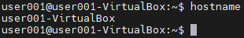
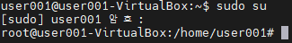
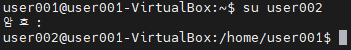
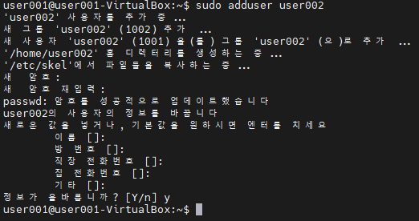
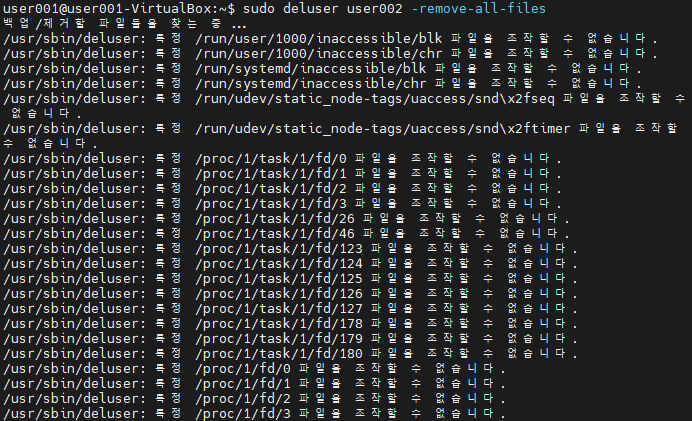
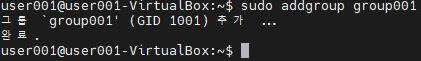

# Host

### 네트워크에 연결된 장치

## 리눅스에서의 Host

- 리눅스는 다중 사용자 시스템으로 설계 되었다
- 리눅스가 설치된 컴퓨터 한 대를 Host라고 부른다

# HostName

장치를 지목할 때 쓰는 이름

## HostName 확인

``` Bash
$ hostname
```



## HostName 변경

`/etc/hostname` 파일의 HostName을 수정한다

``` Bash
$ sudo vi /etc/hostname
```

# 사용자 (User)

- Host PC에는 각자 계정으로 로그인 가능하다
- 관리자 권한이(`root`) 부여된 사용자만 공용 프로그램들의 설치 및 제거를 허용해준다

> 리눅스를 처음 설치하면 Host Name, User ID, root 계정이 자동 생성된다

## 파일권한 설정

각자만의 파일들을 남이 건들지 못하게 설정하는 것


# root 계정 사용하기

## root 계정 비밀번호 변경

``` Bash
$ sudo passwd
```

## root 계정 접속

- 보안을 위해 root로 로그인을 막아두었다
  - 설정을 바꾸면 풀 수 있다
- 사용자 변경을 통해 root 계정을 사용가능하다
- root 계정의 Home 디렉토리는 `/root` 폴더에 있다

``` Bash
$ sudo su
```



- 원래 user로 돌아가기

``` Bash
$ exit
```

## sudo

- root 권한으로 특정 명령어를 수행하는 것

# 리눅스 user 관리

## user 변경

- Switch User

``` Bash
$ su [사용자명]
```



## Host PC에 접속중인 user 확인

``` Bash
$ w
```


## user 계정 생성

``` Bash
$ sudo adduser [사용자명]
```

- 필요한 모든 설정들을 Default 값으로 생성한다

``` Bash
$ sudo useradd [사용자명]
```



- 홈 디렉토리, 계정설정, 사용자 UID 설정, 시작 쉘 환경 등 세부 설정이 가능하다

## user 계정 삭제

``` Bash
$ sudo deluser [사용자명]
```

> 해당 유저의 Home 디렉토리를 포함한 User 파일들은 삭제되지 않는다

``` Bash
$ sudo deluser [사용자명] -remove-all-files
```



## User의 비밀번호 변경

``` Bash
$ passwd
```

# Group 관리

## 리눅스에서 그룹을 관리하는 규칙

- User를 생성하면 그룹이 함께 생성된다

## Group을 쓰는 이유

- 특정 Group만 읽고 쓸 수 있는 파일 설정
- 특정 Group만 쓸 수 있는 디렉토리 설정
- 특정 Group만 실행 시킬 수 있는 프로그램 설정

## 특정 user가 소속된 그룹 확인

``` Bash
$ groups [사용자명]
```


## 그룹 생성

``` Bash
$ sudo addgroup [그룹명]
```



## 그룹 삭제

``` Bash
$ sudo delgroup [그룹명]
```

## 그룹에 user 추가 / 삭제

``` Bash
$ sudo gpasswd -a [사용자명] [그룹명]
$ sudo gpasswd -d [사용자명] [그룹명]
```

