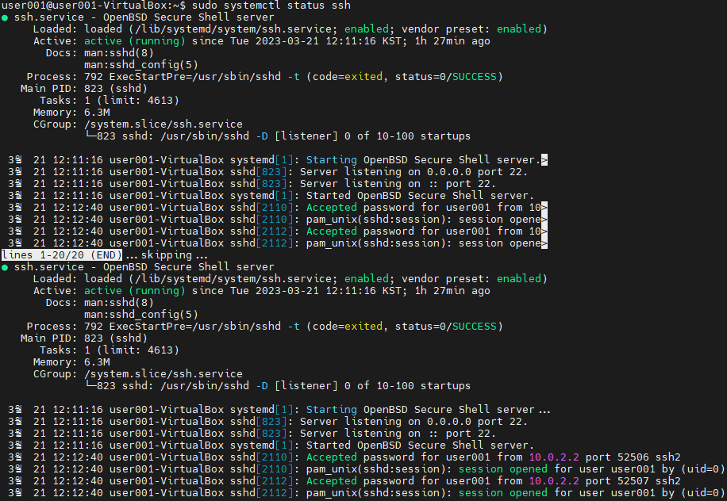
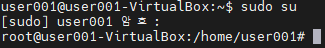
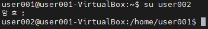
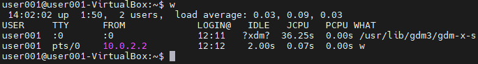
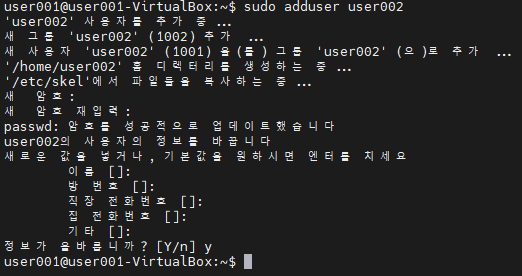
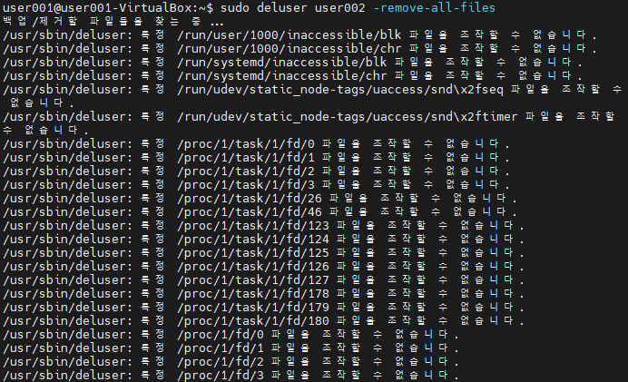
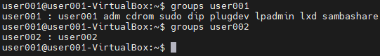
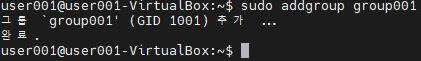
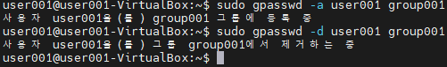

# 터미널 에뮬레이터

터미널을 편리하게 쓸 수 있는 툴  
리눅스 개발자들이 흔히 사용

# 원격 접속

## 원격지 컴퓨터 접속 환경

### 1. GUI 기반 원격 접속

VNC Viewer  

> 임베디드 리눅스에서 GUI 원격 접속이 안되는 경우가 많다

### 2. CLI 기반 원격 접속

SSH, Telnet

## 서버란?

- 요청을 받아서, 원하는 처리를 해준다
- 요청 받아 처리 후, 결과를 요청한 곳에 전달한다
- 서버 프로그램
  - 클라이언트의 입력을 원격지 PC에 입력해주는 프로그램
  - 결과 화면을 클라이언트에 전달한다
  - ex) openSSH

## 클라이언트란 ?

- 클라이언트는 서버에게 요청을 하는 것을 뜻한다
- 클라이언트 프로그램
  - 키보드 입력을 서버에 전달한다
  - ex) mobaXterm


## 서버 프로그램 설치

``` Bash
$ sudo apt install openssh-server
```

- 설치시 서버 프로그램이 자동적으로 실행된다
- 윈도우의 `서비스` 처럼 백그라운드에서 실행되고 있다

> 리눅스에서는 백그라운드에서 실행되는 프로그램을 `시스템 데몬`이라고 한다

### 시스템 데몬 상태 확인 방법

``` Bash
$ sudo systemctl status ssh
```

- systemctl : 시스템 컨트롤
- 눈에 보이지 않고, 뒤에서 동작하는 프로그램이라, 시스템 컨트롤 명령어로 동작을 확인한다
- q를 누르면 종료된다



# 원격접속 프로토콜

통신할 때 규칙  

- A와 B가 통신하는데 서로 같은 프로토콜을 써야만 통신이 가능하다

## 쉘 접속용 프로토콜

1. telnet
   - 암호화 안하는 프로토콜
   - 프로그램
     - telnetd
2. ssh
   - 암호화 하는 프로토콜
   - 프로그램
     - openssh-server

## 파일 전송용 프로토콜

1. FTP (File Transfer Protocol)
2. SFTP (Secure File Transfer Protocol)

# 포트란 ?

한 컴퓨터에는 통신을 하는 프로그램이 여러개가 있다

## 포트 번호

어떤 신호가 들어왔을 때, 어떤 프로그램에게 도착한 신호인지, 구분을 위한 번호

### 자주 사용되는 포트 번호

- 22번 포트
  - ssh, sftp
- 23번 포트
  - telnet
- 80번 포트
  - http

## 포트 포워딩

가상컴퓨터와 진짜컴퓨터의 포트를 일치화 시켜주는것


X-11 Forwarding

- CLI 환경에서 GUI를 지원해 주는 것

# 텔넷 프로토콜

- Tel + Net
- 통신 + 네트워크 프로토콜
- 원격지 컴퓨터를 CLI로 원격접속할 때 사용
- ASCII 코드를 사용한 통신

---

# 임베디드 리눅스 사용방법

## 유선 Serial을 사용

- UART라는 유선 Serial 통신으로 Shell을 사용한다
- 임베디드 장치는 네트워크에 연결이 불가능하다
- 유선 연결을 통해 임베디드 보드 제어 & 개발 & 동작 Log를 확인한다

## SSH / 텔넷 사용

- 네트워크 접속이 가능한 임베디드 장치에서는 텔넷 / SSH 의 사용이 가능하다
- 유선 없이 편리하게 개발이 가능하다
- UART 보다 훨씬 빠르다

---

# 사용자와 파일권한 관리

## Host

네트워크에 연결된 장치

### 리눅스에서의 Host

- 리눅스는 다중 사용자 시스템으로 설계 되었다
- 리눅스가 설치된 컴퓨터 한 대를 Host라고 부른다

## HostName

장치를 지목할 때 쓰는 이름

### HostName 확인

``` Bash
$ hostname
```


### HostName 변경

``` Bash
$ sudo vi /etc/hostname
```

## 사용자

- Host PC에는 각자 계정으로 로그인 가능하다
- 관리자 권한이(`root`) 부여된 사용자만 공용 프로그램들의 설치 및 제거를 허용해준다

> 리눅스를 처음 설치하면 Host Name, User ID, root 계정이 자동 생성된다

## 파일권한 설정

각자만의 파일들을 남이 건들지 못하게 설정하는 것

# root 계정 사용하기

## User의 비밀번호 변경

``` Bash
$ passwd
```

## root의 비밀번호 변경

``` Bash
$ sudo passwd
```

## root 계정에 접속하는 방법

- 보안을 위해 root로 로그인을 막아두었다
  - 설정을 바꾸면 풀 수 있다
- 사용자 변경을 통해 root 계정을 사용가능하다
- root 계정의 Home 디렉토리는 `/root` 폴더에 있다

``` Bash
$ sudo su
```



- 원래 user로 돌아가기

``` Bash
$ exit
```

# 리눅스 user 관리

## user 변경

- Switch User

``` Bash
$ su [사용자명]
```



## Host PC에 접속중인 user 확인

``` Bash
$ w
```



## user 계정 생성

``` Bash
$ sudo adduser [사용자명]
```

- 필요한 모든 설정들을 Default 값으로 생성한다

``` Bash
$ sudo useradd [사용자명]
```



- 홈 디렉토리, 계정설정, 사용자 UID 설정, 시작 쉘 환경 등 세부 설정이 가능하다

## user 계정 삭제

``` Bash
$ sudo deluser [사용자명]
```

> 해당 유저의 Home 디렉토리를 포함한 User 파일들은 삭제되지 않는다

``` Bash
$ sudo deluser [사용자명] -remove-all-files
```



# Group 관리

## 리눅스에서 그룹을 관리하는 규칙

- User를 생성하면 그룹이 함께 생성된다

## Group을 쓰는 이유

- 리눅스의 경우
  - 특정 Group만 읽고 쓸 수 있는 파일 설정
  - 특정 Group만 쓸 수 있는 디렉토리 설정
  - 특정 Group만 실행 시킬 수 있는 프로그램 설정

## 특정 user가 소속된 그룹 확인

``` Bash
$ groups [사용자명]
```



## 그룹 생성

``` Bash
$ sudo addgroup [그룹명]
```



## 그룹 삭제

``` Bash
$ sudo delgroup [그룹명]
```

## 그룹에 user 추가 / 삭제

``` Bash
$ sudo gpasswd -a [사용자명] [그룹명]
$ sudo gpasswd -d [사용자명] [그룹명]
```

