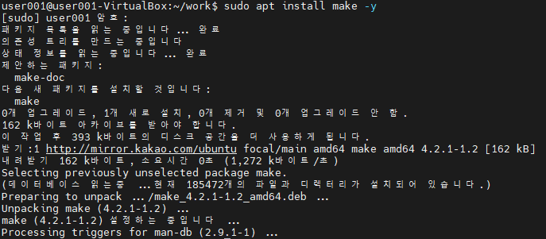
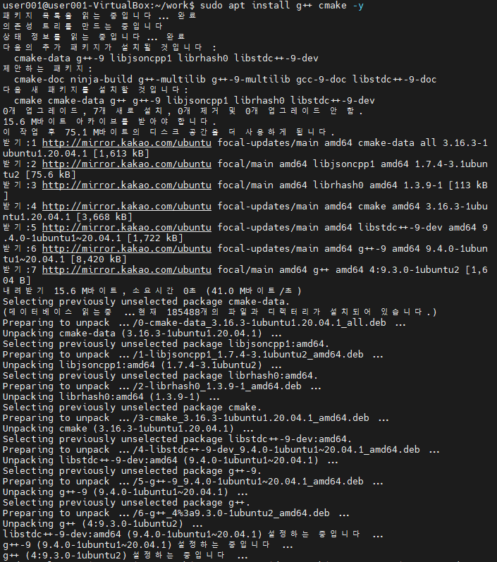

## file

```
$ file [파일명]
```

- ELF : 실행파일

---

# Build

소스코드에서 실행 가능한 Software로 변환하는 과정 (Process) 또는 결과물

## C언어 빌드 과정 (gcc)

### 1. Compile & Assemble

- 하나의 소스코드 파일로 0과 1로 구성된 Object 파일이 만들어짐

``` Bash
$ gcc -c ./[파일명]
$ gcc -c ./*.c
```

### 2. Linking

- 만들어진 Object 파일들 + Library 들을 모아 하나로 합침

``` Bash
$ gcc ./[Object 파일명] ./[Object 파일명] -o ./[출력 파일명]
```

# 빌드 자동화 스크립트 제작하기

## Build Script 제작하기

1. build.sh 파일 vi를 통해 생성
``` Bash
#!/bin/bash

gcc -c ./[파일명]
gcc ./[Object 파일명] -o ./[출력 파일명]
rm -r ./*.o
```

## Build Script 실행하기

``` Bash
$ source [sh 파일명]
$ . [sh 파일명]
```

## 빌드 자동화 스크립트의 문제점

- 파이썬 또는 Bash Shell Script를 사용하지 않는다
  - 필요하지 않는 Compile & Assemble을 수행하여 Build 시간이 오래 걸린다

> make Build System을 쓰면 이 문제를 해결할 수 있다

# Build System 체험

- Build 할 때 필요한 여러 작업을 도와주는 프로그램들

## Build System의 종류

- make
- cmake

## Make Build System 설치

``` Bash
sudo apt install make -y
```



## Make 사용방법

1. `Makefile` 이라는 스크립트 파일을 만든다
   - make 문법에 맞추어서 작성한다
   - Bash Shell Script 문법과 다르다

2. 스크립트를 실행한다

``` Bash
$ make
```

## Make Build System의 장점

1. Build 자동화
   - 기술된 순서대로 Build 작업을 수행하는 자동화 스크립트 지원
2. Build 속도 최적화
   - 불필요한 Compile & Assemble 을 하지 않는다

# CMake

- make 같이 build를 직접적으로 하는 도구가 아니다
- Makefile을 자동생성 할 수 있는 Build System이다

## CMake의 결과물

- Makefile이 만들어진다



## CMake 사용방법

1. `CMakeLists.txt` 파일을 생성한다

``` CMake
```

2. `cmake` 명령어를 수행한다

``` Bash
$ cmake .
```

# Make 스크립트

`[Target]:`  
  [명령어]

형식으로 생성한다

## 화면출력 shell 명령어 : `echo`

``` Makefile
HELLO:
  echo "Hello World"
```

> `echo` 명령어는 띄워쓰기를 1개만 허용한다

## Shell Script 명령어 : `@`

수행 할 명령어 입력을 생략하고, 결과만 출력한다

``` Makefile
HELLO:
  @echo "Hello World"
```

## 의존성

``` Makefile
User: HELLO
  echo "User001"

HELLO:
  echo "Hello"
```

## 주석

- `#` 문자로 표시
- 구간 설정, 명령어 생략시 사용한다

## 매크로 : `${}`

- 전역변수와 같은 역할

``` Makefile
UserName = "User001"

User: HELLO
    @echo ${UserName}

HELLO:
    @echo "Hello"
```


### 대입 연산자

- 기존 매크로 내용에 추가 `+=`
  - `+=` 할 때마다, 띄어쓰기 한 칸이 자동으로 추가된다

- Simple Equl `:=`
  - 스크립트 순서대로 현재 기준에서 값을 넣는다
- Reculsive Equl `=`
  - 최종 변수 결과를 집어 넣는다

## Target 변수 : `$@`

Target을 나타내는 변수


``` Bash
$ ls -alh

$ du -sh [파일명]
```