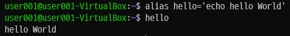

# CLI Shell

## CLI Shell의 종류

- 우분투 기본 CLI Shell : Bash
- 리눅스 사용자에게 인기있는 CLI Shell

## 기본 Shell 확인

``` Bash
$ echo $SHELL
```


## 현재 사용중인 Shell 확인

``` Bash
$ cat /etc/passwd | grep [사용자명]
```

- /etc/passwd 파일에 기록되어 있음
  - 사용자가 사용하는 CLI Shell 이름 확인 가능


## 설치된 CLI Shell의 종류 확인

``` Bash
$ cat /etc/shells
```

- Shell은 부팅하자 마자, 어떤 Shell로 실행될지 선택이 가능하다
- dash
  - 데비안 암키스트 쉘
  - 경량
  - 임베디드 리눅스에서 주로 사용
- bash
  - 본 어게인 쉘
  - 기능이 많다
  - 무겁다
  - PC 리눅스 주로 사용


## CLI Shell의 용량 확인

``` Bash
$ du -h [CLI Shell 경로]
```


## bash 대신 dash

- 대부분의 Shell 명령어는 똑같다
- 일반적인 리눅스 사용에 있어 구분하기 쉽지 않다

# Shell Script 개요

## 축약 명령어 만들기

``` Bash
$ alias [축약 명령어]=[명령어]
```



> `ll` 명령어는 bashrc 파일에서 만든 `ls -alF`의 축약이다
> 
> 

## 실행기 (Runtime)

- Python
  - CPython
- Java
  - JVM
- JavaScript
  - Node.js
  - 브라우저
- Shell Script
  - Bash

> 리눅스 배포판 6.06 이상부터는 `dash` Shell이 기본 Shell 이다
>
> 

## Shell Script를 사용하는 곳

### 자동화 프로그램을 만들 때

1. 자동 Script
2. 자동 세팅 Script
3. 자동 설치 Script

## 쉘 스크립트 생성

- *.sh 파일을 생성한다
- 파일 맨 위에는 `#!/bin/bash`를 적어준다
  - 이 문서가 bash 쉘 스크립트 임을 알린다


## 쉘 스크립트 실행

``` Bash
$ source [쉘 스크립트 파일명]
$ . [쉘 스크립트 파일명]
```


> 두 번째 방법은 가독성이 떨어지므로 권장하지 않는다