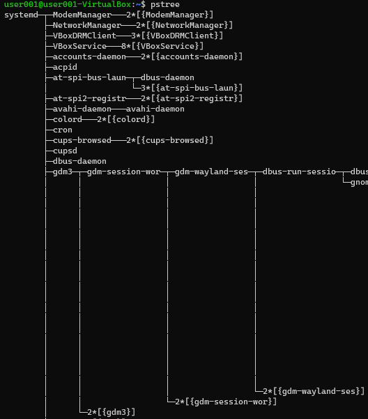

# 메모리 누수 (Memory leak)

## 메모리 누수

- 메모리 자원이 부족해진다
  - 시스템의 성능이 느려지거나 동작하지 않을 수 있다

## 메모리 누수를 발생 시키는 요인

- 동적으로 할당된 포인터 변수를 재할당 할 때
- 파일을 열고 닫지 않을 때
- 동적 할당 후 메모리 해제를 하지 않을 때
- 상호 참조 등

## 해결책

### 재부팅

- 시스템에 존재하던 모든 프로세스와 스레드 등의 메모리 공간이 해제된다
- 임시방편

### 코드 작성

1. 코드를 작성시 유의한다
   - 할당 했으면 해제한다
     - malloc() -> free()
   - 열었으면 닫는다
     - open() -> close()
   - del ...
2. RAII 패턴 사용 - C++
   - Resource Acquisition Is Intialization 디자인 패턴
3. 스마트 포인터 - C++
4. 코드 리뷰
5. 테스트와 디버깅

# 프로세스가 종료되면 기기가 멈추는가

## 펌웨어

- 하나의 프로세스가 돈다
- 프로세스는 프로그램이 실행된 상태이다
- main() 함수가 돌고 있다
- main() 함수가 return 0;
- 프로세스가 종료되고 시스템이 종료된다

## 임베디드 OS

- Linux / RTOS
- OS에는 여러개의 프로세스가 동작한다
- 프로세스가 종료되어도 OS는 여전히 돌고 있다


# 프로세스 (Process)

## 프로세스 개요

- 리눅스를 부팅하면 최초의 프로세스가 존재한다
- 각 프로세스는 ID가 존재한다
- Process ID라고 부르며, 줄여서 PID라고 한다
- PID 0번은 스케줄러이다
- PID 1번은 최초의 프로세스이다
  - Ubuntu GUI : /sbin/init splash
  - Ubuntu CLI : /sbin/init maybe-ubquity

## 프로세스들은 부모 프로세스가 존재한다

- 부모 프로세스에서 복제되어 생성된다
  - fork System Call
  - 자식은 부모의 ID값을 알고있다
    - PPID (Parent PID)
  - 부모는 자식의 ID값을 모른다

> $ ps -ef 명령어를 통해서 PID와 PPID를 확인가능하다


> $ pstree 명령어를 통해서 트리구조를 확인가능하다



## Shell에서 App을 수행하면 Shell이 부모 프로세스가 된다

- 일반적으로 App은 Shell에서 수행이 된다

## Process 확인 방법

1. `$ ps -ef`
   - e : 커널 프로세스를 제외한 모든 프로세스 출력
   - f : Full Format으로 보여준다. PID 등 모든 정보 출력
2. top
3. htop

# Process 구성

## Virtual Address Space

- 각 프로세스는 연속적인 메모리 공간을 사용하고 있다고 착각하도록 한다
  - 실제 물리적 Address와 다르다
- 장점
  - 메모리 파편화에 대한 구현 쉬워짐
  - 저장장치를 메모리인양 사용가능 (swap 영역)
    - 더 큰 메모리 사용

## 프로세스가 사용중인 메모리 맵 확인하기

- /proc -> process의 약어
- process 정보 확인가능

1. 프로그램 실행
2. `ps -ef`로 [PID] 확인
3. cd /proc 에서 [PID]명의 디렉토리를 찾는다
4. [PID] 디렉토리 내의 map 파일을 확인한다

``` Shell
$ cat /proc/[PID]/maps
```

> DATA, BSS, HEAP, STACK 영역의 메모리를 확인할 수 있다

- 각 프로세스는 자신만의 메모리 공간을 가지고 있고, 자신만의 메모리 주소를 쓴다
- 리눅스에서 사용하는 메모리 주소 : Virtual Address Space

---

# Context Switching

- context : 프로세스 안의 어떤 상태 (정보)
- switch : 바꾼다
- ***일이 발생한다***
- CPU는 기본적으로 하나의 프로세스를 실행한다
- 매우 빠르게 여러 프로세스를 실행한다 -> context switching이 일어난다 -> 일이 발생한다
  - 동시 동작하는 것처럼 보인다

## 폰노이만 아키텍쳐

- Context Switching 시 속도차이로 인하여 비용이 발생한다
- Context Switching이 자주 일어나면 좋지 않다

## Context Switching이 일어나는 과정

1. CPU가 프로세스에 접근한다
2. PCB를 보고 어디까지 했는지 확인한다
3. 일을 수행한다
4. 스케줄러로부터 다른 프로세스로 가도록 명령받는다
5. 하던 작업을 정리해서 PCB에 기록한다


# Process 스케쥴링

## 하나의 Core는 여러개 프로세스를 순환하면서 수행한다

- 특정 시간마다 번갈아가면서 수행한다
- 대체로 Round Robin으로 동작하며 OS 마다의 계산 공식에 의해 우선순위가 변경된다

## 프로세스 간 메모리는 독립적으로 운영을 한다

- 각자의 가상 메모리 주소 영역을 갖는다

## IPC (Inter Process Communication)

- 프로세스끼리 값을 주고 받는것
- IPC 방법
  - 프로세스끼리 공유하는 메모리 (Shared Memory)를 쓰는 방법
  - 커널의 도움을 받아 대신 전달해주는 방법
- ex) 크롬 탭 이동

## PCB (Process Control Block)

- 커널이 프로세스를 제어하기 위한 정보를 저장하는 블럭
- 프로세스 Descriptor라고도 한다
- 저장정보
  - 프로세스에 대한 다양한 정보들을 보관
  - 프로세스 상태 (state), PID 등


- ctrl + c
  - SIGINT - 종료
- ctrl + z
  - SIGSTOP - 중지
시그널까지만 전송한다


# PID 찾기

``` Shell
$ ps -ef | grep ./cpu
$ htop
```


``` Shell

$ kill -l

$ kill
```
