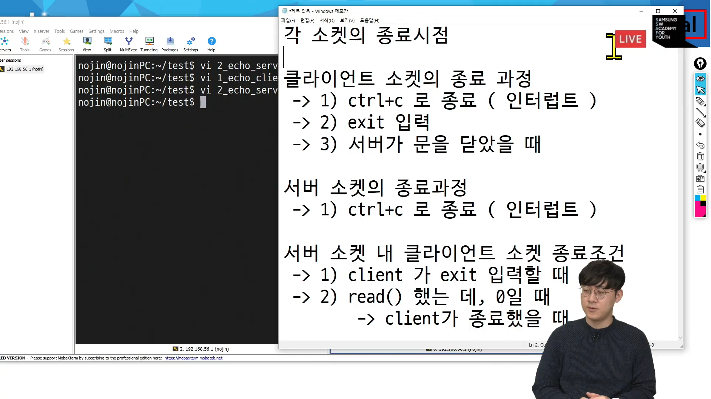

# 서버 소켓

## 동작 순서

- TCP 기반 서버 소켓 동작 순서
  1. socket()
     - 소켓 생성
  2. bind()
     - 소켓에 주소 할당
  3. listen()
     - 클라이언트 연결 요청 대기
  4. socket()
     - 클라이언트 연결 승인
  5. socket()
     - 통신
  6. socket()
     - 소켓 닫기

