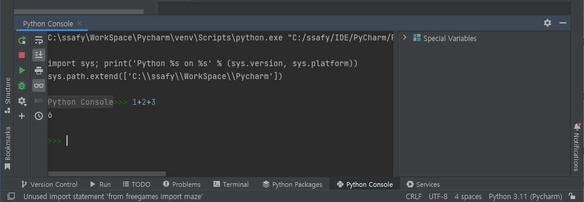

# 파이썬

## 파이썬 용어

- 모듈
  - 큰 System을 이해하기 쉽게 기능별로 나눈 작은 단위
  - 파이썬에서는 `*.py`파일 1개를 의미
- Package
  - 파이썬에서는 `모듈`의 모음을 의미
- Library
  - 다른 사람이 만든 소스코드를 가져다 쓸 수 있도록, 함수 / 클래스들로 구현된 소스코드 모음
- Framework
  - 소스코드 뼈대

# 파이썬 환경

## Library 호환성 문제

- 프로젝트별로 다른 Library를 사용할 경우 문제 발생
- 한 컴퓨터에는 버전별로 Library를 사용하기 어렵다

## 격리된 파이썬 개발환경 도구 (Virtualenv)

- 파이썬 추가 기능들을 설치하다 보면 버전 차이로 인해 충돌 발생 가능성이 있음
- 한 컴퓨터 내 독립된 환경에서 개발을 해주도록 도와주는 프로그램

## `/Lib/site-packages` 폴더

- Python Package 설치도구 (pip)로 설치시 저장되는 장소

## `python.exe`

- 파이썬 스크립트 실행기
- 터미널 창이 뜬다

## `pythonw.exe`

- 파이썬 스크립트 실행기
- 터미널 창이 뜨지 않는다

## Run 버튼

- Run


..


# pip install

## pip

- 온라인에 정식 등록된 Package Library들을 쉽게 Download받고 압축을 풀어 설치까지 해주는 관리 프로그램
- 리눅스의 apt 유틸리티와 같은 역할

## PyPI (Python Package Index)

- 파이썬 관련 패키지들이 들어있는 저장소
- `파이 피 아이`라고 부른다
- [pypi.org](pypi.org)에 내 프로그램을 업로드하면 pip로 다운로드 받을 수 있다

## pip 설치

- `*.whl` 파일 단위로 다운로드 및 압축해제를 진행
- wheel 파일
  - python 배포에 사용되는 표준 내장 package
  - zip을 사용하여 압축되어있는 
  


...


# import 명령어

## from [패키지명] import [모듈명]

``` Py
from freegames import snake
```

## import [패키지명]

- 특정 모듈 전체를 import 한다
- C언어에서 include 역할

``` Py
import freegames.maze
```

...


# Shell의 이해

## Shell

- 어떤 대상을 제어하고, 결과를 확인하기 위해 만들어진, 사용자를 위한 중간 전달자 역할
- 인터페이스

## GUI Shell (Graphic UI)

- GUI를 사용하여 운영체제의 커널에게 명령을 내리고, 결과를 확인할 수 있다  
  
## GUI Shell (Graphic UI)

- CLI를 사용하여 운영체제의 커널에게 명령을 내리고, 결과를 확인할 수 있다

## Python의 Shell

- python 인터프리터에게 명령어를 던지고, 결과를 확인할 수 있다

# 다양한 Python 동작 방법

## Python을 사용하는 4가지 방법

1. Python Shell
   - cmd 창에서 python이라고 입력


2. Python IDLE

   - IDLE 실행
   - File - New File


3. OS Shell에서 Python Script 실행


4. Pycharm 사용




...


파이썬은 모든 데이터를 객체단위로 관리하므로
자료형에 구애받지않고 변수에 저장할 수 있다

- 변수에 객체의 주소를 저장한다


# 주석

``` py

"""
주석처리
"""
```

# 파이썬 연산자

## 나눗셈 `/`

- 몫을 소수점 이하까지 계산한다

## 몫 `//`

- 몫을 정수로 계산한다

## 나머지 `%`

- 나머지를 계산한다

## 제곱 `**`

- 제곱 연산을 연산자를 통해서 할 수 있다

# floating point error

- 컴퓨터에서 소수점을 나타내는 방식으로 인해 발생하는 에러

# 아스키 코드 번호

- python 에서는 문자열에 연산을 할 수 없다

## `odr` 함수

``` py
ord('A')
```

## `chr` 함수

``` py
chr(97)
```

## 절대값 함수

``` py
abs(-1)
```

## 승수 함수

``` py
pow(10,2)
```

# 변수 다루기

## 자료형 정리

``` py
a = 10          # int
b = 3.14        # float
c = 'c'         # string
d = "string"    # string
e = [1,2,3]     # 리스트
f = (1,2,3)     # 튜플
g = {"age" : 3, "name" : "minco"}
# 딕셔너리 (c언어의 unordered map / key & value 값의 타입을 정의할 필요가 없다)
h = {1,2,3}
```

> 튜플의 경우 특정 인덱스의 값을 수정하지 못한다

## 튜플

```
a, b = 2, 3
```

# Script 용어의 이해

## Interpreter

- 소스 코드를 즉시 번역하여 실행하는 프로그램

## Interpreter Language vs Compile Language

- Compile 언어
  - Build (컴파일 + 링킹) 후 Run을 해야 실행 결과를 확인 가능
  - 전체 코드를 하나의 프로그램으로 compile한 후에 실행
  - C, C++
- Interpreter 언어
  - Run을 하면 실행 결과를 확인 가능
  - 한 줄씩 프로그램화 시켜서 실행
  - Python

## Script Language

### Script의 의미

- 대본
- 코드를 일정 단위로, 번역(컴파일) 없이 실행 가능한 내용

## Python Runtime의 종류

- Cpython
  - 파이썬 기본
  - 파이참에서 사용
- PyPy
  - 코드를 분석하여 반복적인 처리를 최대한 효율적으로 구성
  - PyPy는 업데이트가 느리다
  - 호환 부분에서 문제가 생기는 경우가 많다
  - SWEA에서 사용

> Runtime이 없으면 Python으로 만든 프로그램은 실행이 불가능하다

# 입출력 함수

## 명령어 사용법 찾기

``` py
print(help(range))
```

## PEP8 (Python Enhance Proposal 8)

- python script를 작성할 때 코딩 스타일 가이드
  - 들여쓰기는 공백 4개
  - 한줄의 최대 글자는 79
  - import는 하나만 할 것
  - 함수 / 클래스는 빈 줄 2개 넣기
  - 클래스에서 메서드는 빈 줄 1개 넣기
  - 카멜이 아닌 스네이크로 작성

## 입력 처리

### input()

- 문자열로 입력이 됨
- 수 입력시 반드시 변환이 필요

- 속도가 더 빠르다

``` py
sys.stdin.readline()
```

### split()

- 파이썬은 띄어쓰기를 엔터로 취급하지 않는다
- 띄어쓰기 인경우, split으로 나눠줘야 한다

### map()

- 한꺼번에 int로 만드는 방법

``` py
a, b = map(int, input(),split())
```

## print()

- `print(, sep=[구분 문자], end=[끝 문자])`
- sep의 기본값은 ' '
- end의 기본값은 '\n'

``` py
print(row, col, sep=", ")
```

## 리스트

- `*` 연산자로 복사가능
- 리스트를 복사할 경우 주소가 복사됨에 유의

``` py
nums = [[1, 2]] * 10

a = nums * 3
a[0][0] = 100
print(nums)
```

matrix 입력

```
```

# 반복문

## for 문

- i를 0에서 부터 10 전까지 증가시키며 반복실행
- `for [변수명] in [데이터들]`
- 변수명에 데이터들에 들어있는 데이터를 하나씩 가져오면서 실행

``` py
for i in range(10):
    print(i)
```

# 조건문

## if

- `if [조건문]:`

``` py
if a != b:
    print("#")
```

## elif

- `elif [조건문]:`


# 함수

`def [함수이름]([매개변수들]):`

- 내용이 없을 경우 에러
- 당장 채워넣을 내용이 없을 경우 내용으로 `pass` 작성


``` py
data = "-".join(input().split())

print(data)
```

# 2차원 배열 초기화

``` py
matrix = [[0] * 3 for _ in range(3)]
```

# 조건부 초기화

``` py
a = [i for i in range(100) if i % 2 == 0 or i % 3 == 0]

print(a)
```

# 2차원 배열 입력

``` py
matrix = [[0] * 5 for _ in range(5)]

value = 1

for row in range(len(matrix)):
    for col in range(len(matrix[row])):
        matrix[row][col] = value
        value += 1

print(matrix)
```


- 자료형에 따라 속도가 다르다
  - 리스트 : O(n)
  - 딕셔너리 : O(1)

``` py
if('abc' in dt):
```


``` py
datas = {'test1':1, 'test2':2, 'test3':3}

for key, value in datas.items():
    print(key, value)

for key in datas.keys():
    print(key)

for value in datas.values():
    print(value)
```

# 슬라이싱

``` py
b = a[::-1] # 역방향으로
b = a[::1]  # 정방향으로
```