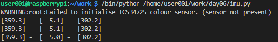

# 센서의 활용

## 센서란?

- 정보를 수집하여, 수치 값으로 만들어내는 장치
- 오감 / 초음파 / 압력 / 자기 / 온도 / 가스 / 가속도 등을 수치로 만들어 낼 수 있다

## 센서의 활용

### 침입탐지 시스템

- 출입문
- 창문
- 적외선

### 스마트 워치

- 심장박동수
- 체온 감지
- 혈압

### 게임

- 자이로 센서

### MEMS (Micro Elctro Mechanical System)

- 반도체 제조 공정으로 만드는 초소형 기계
- 톱니바퀴등을 Nano 공정으로 제작한다
- 초소형 센서를 제작할 때 사용

# Sense Hat (센스햇)

## 센스햇

- 센서들이 모여있는 Hat
  - 자이로 센서
  - 가속도 센서
  - 기압 센서
  - 지자기 센서
  - 온 / 습도 센서
- 컨트롤러와 Display
  - 8x8 LED
  - 8방향 조이스틱

## Sense Hat Emulator (가상 센스햇)

- Sense Hat이 없더라도, 가상으로 동작시켜 볼 수 있다
- 파이썬 예제 동작이 가능하다

> 라즈베리파이의 전원을 우선 분리한 후 Sense Hat을 탈부착하여야 한다

``` Shell
$ sudo apt-get update
$ sudo apt-get install python3-sense-emu sense-emu-tools
```

## 센스햇 코드 오동작

1. 에러 메시지 1

``` Shell
OSError: Cannot detect RPi-Sense FB device
```

``` Shell
$ sudo vi /boot/config.txt
```

- 가장 아래줄에 `dtoverlay=rpi-sense`를 작성 후, 저장 및 재시작하면 해결된다

2. 에러 메시지 2

``` Shell
WARNING:root:Failed to initialise TCS34725 colour sensor. (sensor not present)
```
- TCS34725 칼라 센서가 사라졌지만 라이브러리에 반영이 되지않아 발생하는 에러
- 무시하여도 된다

## Library

[공식 Document](https://pythonhosted.org/sense-hat/)

## 센스햇 내 센서들

- I2C를 통해 많은 센서들이 내장되어있다
- 보드에 `실크` 라고 하는 흰색 표기로 센서들을 표시해 두었다
- 해당 표기를 센스햇의 회로도에서 찾아볼 수 있다

[센스햇 회로도](https://datasheets.raspberrypi.com/)

## 온습도 센서

- HTS221
- Silk
  - U3
- 온도
  - 15 ~ 40도
  - 오차 : 0.5도
- 습도
  - 20 ~ 80%
  - 오차 : 3.5%

``` py
from sense_hat import SenseHat

sense = SenseHat()

while True:
    humi = sense.get_humidity()
    temp = sense.get_temperature()
    
    print("Humidity : %s" % humi)
    print("Temperature : %s" % temp)
    sleep(1)
```


## 기압 센서

- LPS25H
- Silk
  - U5
- 대기압
  - 260 ~ 1260hPa

``` py
from sense_hat import SenseHat

sense = SenseHat()

while True:
    press = sense.get_pressure()
    
    print("Pressure : %s" % press)
    sleep(1)
```


## LED Matrix

- LED2472G LED Driver
- Silk
  - U7
- 8 x 8 LED Matrix
- LED 64개를 Driver를 통해 제어한다
  - MCU로 정해진 규칙의 신호만 보내면 LED 64개를 손쉽게 제어 가능하다


``` py
from sense_hat import SenseHat

sense = SenseHat()

sense.set_rotation(90)
sense.show_message("Rpi Sense Hat")
```


``` py
from sense_hat import SenseHat

sense = SenseHat()

X = [50, 50, 50]
O = [255, 215, 0]

alpha = [
    X, X, X, O, O, X, X, X,
    X, X, O, X, X, O, X, O,
    X, O, X, X, X, O, O, X,
    O, X, X, X, X, X, O, X,
    O, X, X, X, X, X, O, X,
    O, X, X, X, X, O, O, X,
    X, O, X, X, O, X, O, X,
    X, X, O, O, X, X, X, O,
]

sense.set_pixels(alpha)
```

## IMU (Inertial Measurement Unit: 관성 측정 장치)

- LSM9DS1
- Silk
  - U4
- 3축센서
  - 자이로스코프 / 가속도 / 지자기 센서
  - (X, Y, Z) 값을 읽을 수 있다
- 6축 센서
  - 자이로스코프 + 가속도 센서
  - (X, Y, Z) 두 세트의 값을 읽을 수 있다
- 9축 센서
  - 자이로스코프 + 가속도 + 지자기 센서
  - (X, Y, Z) 세 세트의 값을 읽을 수 있다

### 자이로스코프 측정

``` py
from sense_hat import SenseHat

sense = SenseHat()

while True:
    acc = sense.get_orientation_degrees()
    print(f'[{acc["pitch"]:5.1f}] - ', end= ' ')
    print(f'[{acc["roll"]:5.1f}] - ', end= ' ')
    print(f'[{acc["yaw"]:5.1f}]', end= ' ')
    print()
```



### 가속도 측정

``` py
from sense_hat import SenseHat

sense = SenseHat()

while True:
    acc = sense.get_accelerometer_raw()
    print(f'[{acc["x"]:5.1f}] - ', end= ' ')
    print(f'[{acc["y"]:5.1f}] - ', end= ' ')
    print(f'[{acc["z"]:5.1f}]', end= ' ')
    print()
```


### 자기력 측정

``` py
from sense_hat import SenseHat

sense = SenseHat()

while True:
    acc = sense.get_compass_raw()
    print(f'[{acc["x"]:5.1f}] - ', end= ' ')
    print(f'[{acc["y"]:5.1f}] - ', end= ' ')
    print(f'[{acc["z"]:5.1f}]', end= ' ')
    print()
```


## 조이스틱

- 상, 하, 좌, 우 클릭 방식

### 폴링 방식

``` py
from sense_hat import SenseHat

sense = SenseHat()

while True:
    event = sense.stick.wait_for_event()
    print("The joystick was {} {}".format(event.action, event.direction))
    sleep(0.1)

```


### 인터럽트 방식

``` py
from sense_hat import SenseHat, ACTION_PRESSED, ACTION_RELEASED
from signal import pause

def pushed_up(event):
    global y
    if event.action != ACTION_RELEASED: y -= 1

def pushed_down(event):
    global y
    if event.action != ACTION_RELEASED: y += 1

def pushed_left(event):
    global x
    if event.action != ACTION_RELEASED: x -= 1

def pushed_right(event):
    global x
    if event.action != ACTION_RELEASED: x += 1

def refresh():
    sense.clear()
    sense.set_pixel(x, y, 255, 255, 255)

x = 3
y = 3

sense = SenseHat()

sense.stick.direction_up = pushed_up
sense.stick.direction_down = pushed_down
sense.stick.direction_left = pushed_left
sense.stick.direction_right = pushed_right
sense.stick.direction_any = refresh

pause()
```