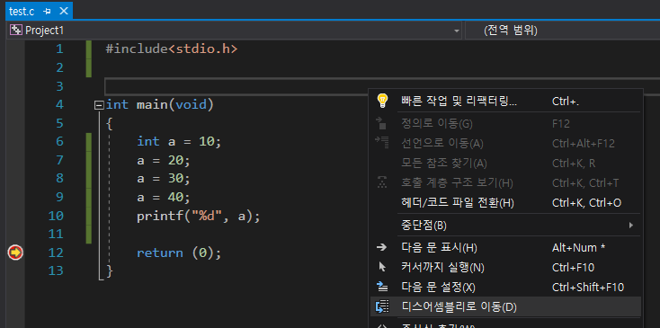

# 커널 빌드

## 라즈베리파이 OS 커널 빌드

[공식 홈페이지](https://www.raspberrypi.com/documentation/computers/linux_kernel.html)

## 빌드 순서

0. 커널 버전확인

``` shell
$ uname -r
```

- 출력되는 버전 명
  - 7l
    - 32비트
  - 8l
    - 64비트
    - 라즈베리파이 OS 재설치 필요

> `$ sudo apt-get upgrade`시 커널 버전이 바뀌므로 OS 설치 후 해당 명령어는 사용하지 않는다

1. 종속성 도구 설치

``` shell
$ sudo apt install git bc bison flex libssl-dev make
```

2. 커널 소스코드 다운로드

``` shell
$ cd /usr/src
$ sudo git clone --depth=1 https://github.com/raspberrypi/linux
```

3. Config 파일 생성

``` shell
$ cd linux
$ sudo make bcm2711_defconfig
```

4. Build

``` Shell
$ make -j4 zImage modules dtbs
```
- -j4
  - cpu 4코어 활용
- zImage
  - Linux 커널
- modules
  - 커널에서 사용하는 Device Driver
- dtbs
  - 디바이스 드라이버 세부 정보

5. Build 결과물 복사

``` shell
$ sudo make modules_install
$ sudo cp arch/arm/boot/dts/*.dtb /boot/
$ sudo cp arch/arm/boot/dts/overlays/*.dtb* /boot/overlays/
$ sudo cp arch/arm/boot/dts/overlays/README /boot/overlays/
$ sudo cp arch/arm/boot/zImage /boot/$KERNEL.img
```

6. 최종 환경 확인

### OS가 32비트인지 확인

``` shell
$ getconf LONG_BIT
```

### 아키텍쳐 확인

``` shell
$ uname -m
```

### 커널버전 확인

``` shell
$ uname -r
```

- 리셋 전후로 커널 버전이 달라져야 한다

# 실습환경

- 라즈베리파이에는 커널 존재
- 커널 헤더 존재

## 커널 빌드를 해야하는 이유

- 커널 모듈 형식의 디바이스 드라이버의 빌드 결과물 (.ko)가 커널에서 동작한다
  - 커널 자체도 어떤 소스코드를 컴파일한 결과를 실행해서 동작하는 프로세스
  - 커널헤더에 있는 커널API (함수)를 사용해서 제어한다

- 커널 API (일반함수, 인라인함수, 매크로함수)가 있다
- 매크로 함수와 인라인 함수 
  - 컴파일 하면서 치환이 된다
  - 컴파일은 되돌릴 수 없다
  - 커널 모듈이 커널 API들이 어디있는지 알고 사용을 해야한다


# volatile

## 컴파일러의 역할

- 사람이 짠 `*.c` 코드를 보고 기계어로 변환한다

## 컴파일러가 최적화 하는 과정

### 어셈블리어 확인



- 중단점을 걸고 디버깅 시작한다
- 코드창을 우클릭할 경우 `디스어셈블리로 이동`을 통해 어셈블리어 확인이 가능하다

### 솔루션 구성을 `Debug`로 설정한 경우

- 최적화를 하지 않고 컴파일 한다

### 솔루션 구성을 `Release`로 설정한 경우

- 불필요한 절차를 다 생략하고 최적화해서 컴파일한다

### 변수 선언 앞에 `volatile`을 추가할 경우

- 컴파일러가 특정 변수를 최적화하는 것을 `volatile`로 막아줄 수 있다
- 임베디드 S/W 개발자로서 H/W와 밀접한 코드를 작성할 때 주의하여야 한다

## volatile이 필요한 경우

- 메모리 주소를 가진 I/O 레지스터
- 인터럽트 핸들러가 값을 변경하는 전역 변수

> volatile을 너무 많이 사용하면 코드 최적화가 되지 않으므로 적재적소에 사용해야 한다