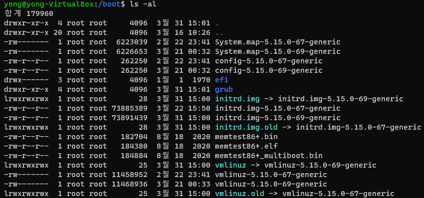

# 부트로더

## Bootloader (부트로더)

- 부팅시 동작되는 프로그램
- Disk에 저장되어 있는 운영체제를 실행시키는 역할
- 부트 스트랩 로더 / 부트 스트랩 / 부트로더
- OS와 달리 동작이 눈에 보이지 않는다

> 라즈베리파이는 자체 부트로더를 사용한다

## 부트로더의 기능

- 다중 OS 부팅
- 장치 제어 및 테스트
- OS가 실행되어 메모리에 적재 될 수 있도록 도와준다

> OS도 파일이며, 프로세스로 동작한다

## 부트로더의 종류

- Ubuntu
  - GRUP2
- 윈도우
  - Bootmgr
- 오픈소스
  - U-Boot

# Linux Kernel Image

## Linux Kernel

- 리눅스의 핵심 동작 코드

## Image

- 램에 그대로 올라가면 실행 가능해지도록 만들어진 Binary File

## Linux Kernel Image

- 리눅스 소스코드를 빌드 후, 즉시 램에 올라가면 동작되도록 만들어진 Binary File
- 리눅스 Build시 만들어지는 최종 결과물

## 리눅스 커널 이미지 파일의 위치

### `/boot`

- `/boot/vmlinuz-5.4...`
  - kernel image
- `/boot/vmlinuz`
  - 현재 사용중인 커널 이미지 심볼릭 링크

> 우분투 부트로더 grub 도 확인 가능하다

- 리눅스 커널 이미지는 압축되어 관리된다
  - 부트로더가 압축을 풀어 메모리에 적재한다

## 커널 이미지의 두 가지 이름

- zImage
  - gzip으로 압축된 Kernel Image
- bzImage
  - 빅 zImage
  - 파일 크기가 큰 Kernel Image
  - 통상 1MB이상 수준

## 리눅스 운영체제를 제작하는 과정

1. 원하는 버전의 리눅스 커널을 인터넷에서 다운로드
2. 리눅스 커널 수정
   - 디바이스 드라이버 개발
   - 디바이스 드라이버 추가
   - 소스코드 수정
3. 리눅스 커널을 Build 하여 Image 생성
4. 리눅스의 경우 Build시 GRUB도 함께 빌드됨
   - 이외의 부트로더를 사용하고 싶으면 다운로드
5. 보드에 부트로더와 리눅스 커널 이미지를 함께 사용해서 보드를 동작

# PC Booting Process

## CMOS와 BIOS

- CMOS
  - CMOS Chipset
    - RTC
    - NVRAM
  - CMOS Data를 저장
    - 메모리 크기
    - 부팅순서
    - HW 구성 정보
  - 배터리 전원을 사용
  - 설정 값들이 적혀있다
- BIOS
  - 기본적인 I/O를 위한 Firmware
  - 컴퓨터 부팅시 바로 BIOS가 동작을 시작한다
  - ROM BIOS에 BIOS설정 Utility가 들어있다
  - CMOS의 설정값들을 변경 가능하다

## POST (Power On Self Test)

- BIOS에서 Power를 켜자마자 주변장치들을 검사하는 과정
- BIOS가 POST를 하고 있을 때, Log Message가 출력된다
- 컴퓨터를 켜자마자 POST 진행화면 / 결과 Message를 확인 가능하다

## UEFI (Unified Extensible Firmware Interface: 통일 확장 인터페이스)

- BIOS를 대체하는 Firmware
- 그래픽 UI 지원
- 2.2TB 이상의 디스크 사용을 위한 GPT (Guided Partition Table) 지원

## Linux Boot Loader

- GRUB2
  - GNU 프로젝트에서 개발한 부트로더
  - 현 대부분 리눅스 배포판은 GRUB2를 사용한다

[광주_6반_김도훈] 