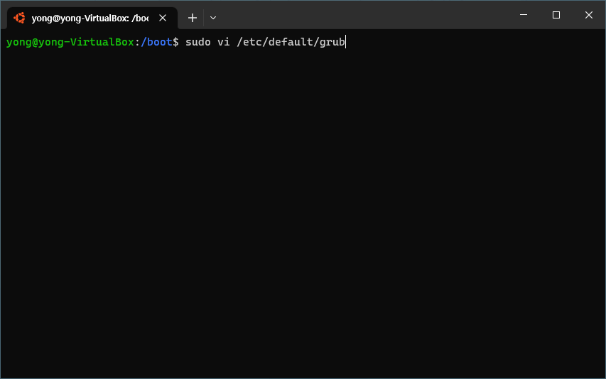
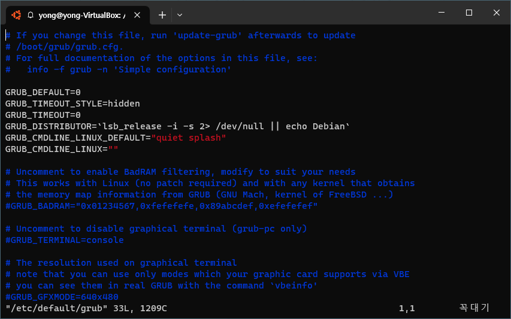
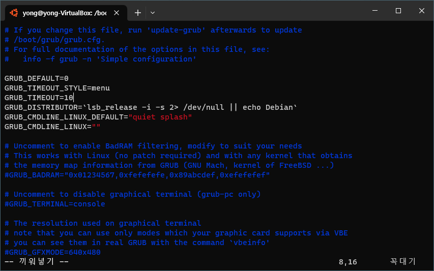
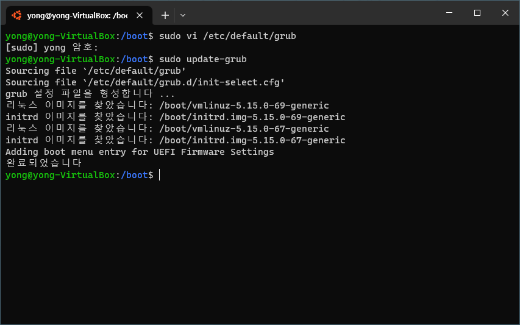
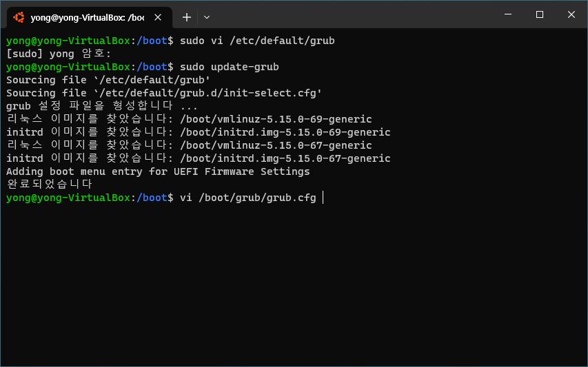
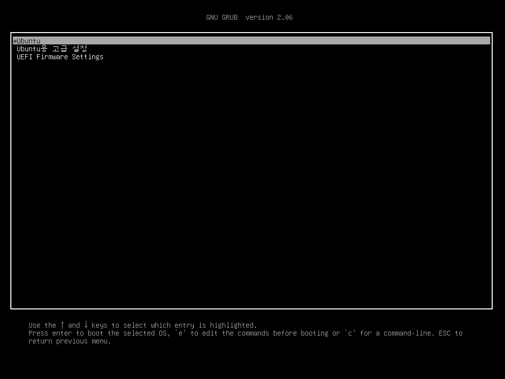
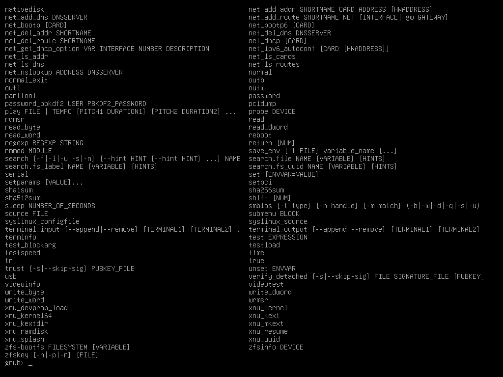
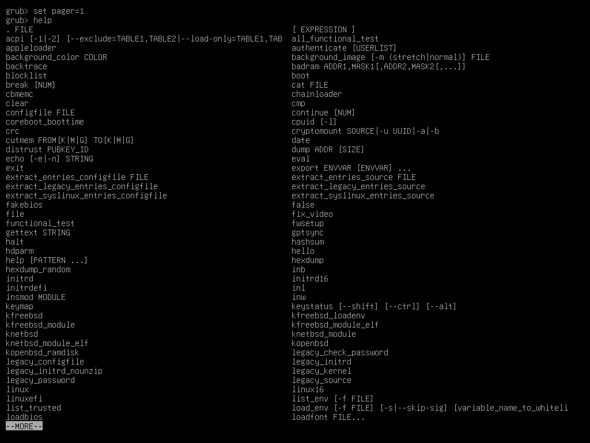
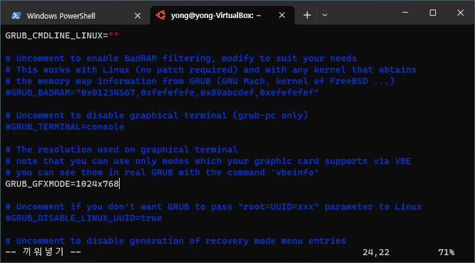

# Grub

## Grub 설정 파일 변경하기

- 설정파일 열기

``` bash
$ sudo vi /etc/default/grub
```



- 부트 메뉴 출력
  - `GRUB_TIMEOUT_STYLE=menu`
- Timeout 설정
  - `GRUB_TIMEOUT=10`





## 설정파일 적용

- `update-grub`을 수행해야, grub 수정 사항이 저장된다

``` bash
$ sudo update-grub
```




## boot directory

- `/boot`
  - Linux OS가 부팅에 사용되는 파일들
- `/boot/grub`
  - 부트로더 관련 파일들

## Grub 설정파일 위치

- `update-grub` 명령어를 통해 만들어지는 환경설정 파일



## 재부팅하여 Grub 확인



- e
  - grub.cnf 내용 확인

## command 모드

- c
  - command 모드로 진입
- `ESC`
  - 다시 메뉴 선택화면으로 돌아가기


- help 명령어
  - `help`
  - 다양한 bootloader 명령어가 존재



> scroll이 넘어가 모든 화면이 나오지 않는다

- page 세팅
  - `set pager=1`


- 다시 help 진입
  - Page Down키를 눌러서 한 페이지 씩 볼 수 있다



## 해상도 변경하기

- `/etc/default/grub`에 `GRUB_GFXMODE=[width]x[height]`을 추가하면 해상도가 변경된다
- 설정 완료 후 `update-grub`을 통해 수정사항을 저장한다




...


